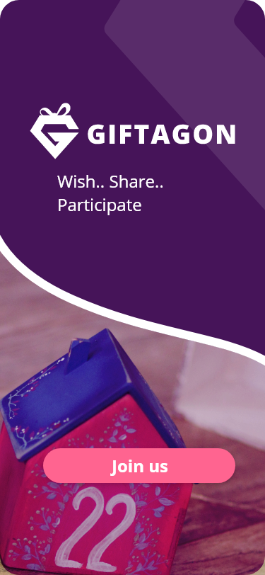

# Giftagon
# 🎁 Giftagon — Social Gifting Platform

**Giftagon** is a social platform that redefines the meaning of gifts — transforming them from random presents into **meaningful, useful, and community-driven experiences**.


> 💡 **Design Inspiration**: This app is based on the original UI/UX concept by [Mohammed Selmi](https://www.behance.net/mohammedselmi) on Behance:  
> 🔗 [Giftagon — Behance Project](https://www.behance.net/gallery/126480607/Giftagon)
## 🎨 Design Mockups




Built with **Flutter**, Giftagon works seamlessly on **mobile, tablet, and web** — and supports **offline-first** functionality using **Hive** local database.

---

## ✨ Features

- 🎯 **Smart Wishlist**: Users create wishlists with deadlines, circles (family/friends/others), and privacy (surprise mode).
- 👥 **Group Gifting**: Collaborate with friends to fund a single gift.
- 💬 **Social Interaction**: Like, comment, and share gifts/events.
- 🔔 **Real-time Notifications**: Get notified when someone contributes or comments.
- 📱 **Responsive Design**: Works on mobile, tablet, and desktop.
- 📥 **Offline-First**: All data is saved locally using Hive — no internet required.
- 👤 **Profile Management**: Edit your info, privacy, and notification settings.

---

## 🛠️ Tech Stack

- **Framework**: Flutter 3.22+
- **State Management**: StatefulWidget (for simplicity and control)
- **Local Database**: Hive (NoSQL, offline-first)
- **UI/UX**: Custom design based on Behance mockups — with full RTL & LTR support
- **Navigation**: Named routes + Drawer + EndDrawer for mobile

---

## 📸 Screenshots

*(You can add screenshots later — just create a `/screenshots` folder and link them here)*

---

## 🚀 Getting Started

1. Clone the repo:
   ```bash
   git clone https://github.com/your-username/giftagon.git
